# Forkyz Crosswords

Forkyz is an unofficial fork of [Shortyz](https://github.com/kebernet/shortyz/)
with wider-ranging support for a variety of puzzle types (e.g. grids that don't
follow a standard across/down set-up) and other customisations.

## Features

Play crosswords! Full board view, clue list view, make notes about clues, anagram helper.

Support for block, bar, and acrostic puzzles. Puzzles don't have to be across/down. E.g. rows gardens and marching bands are supported in JPZ and IPuz.

## Screenshots

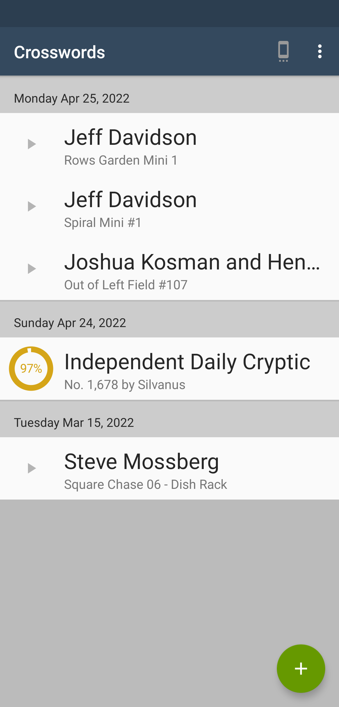
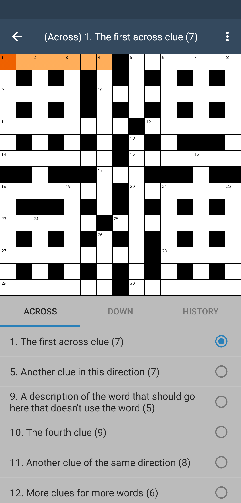
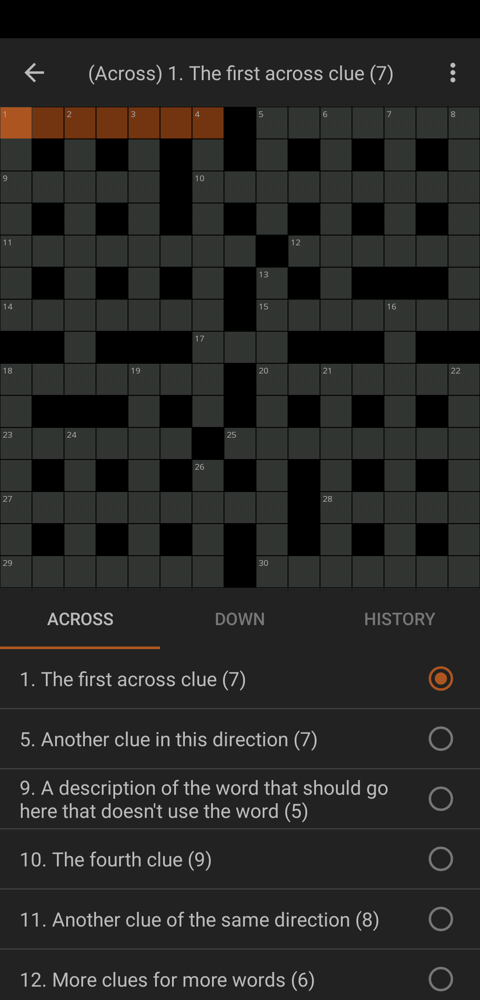
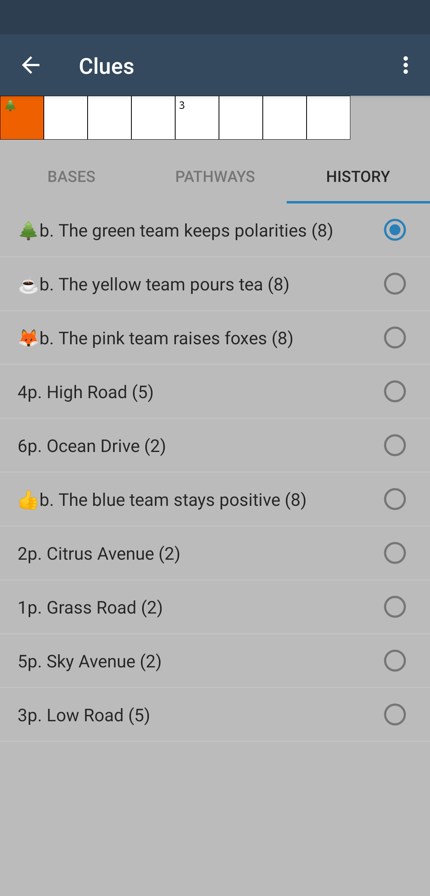
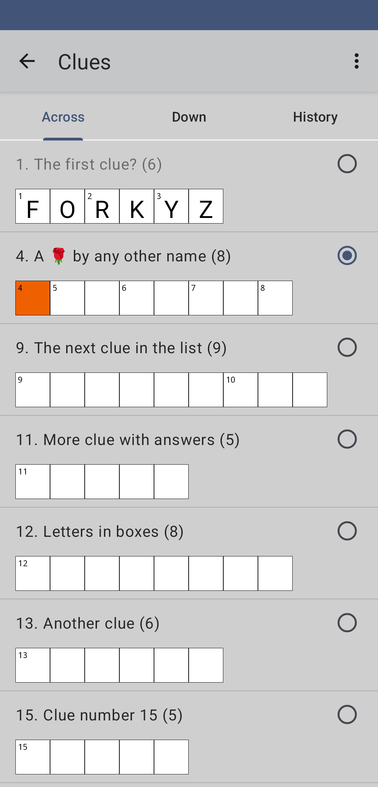
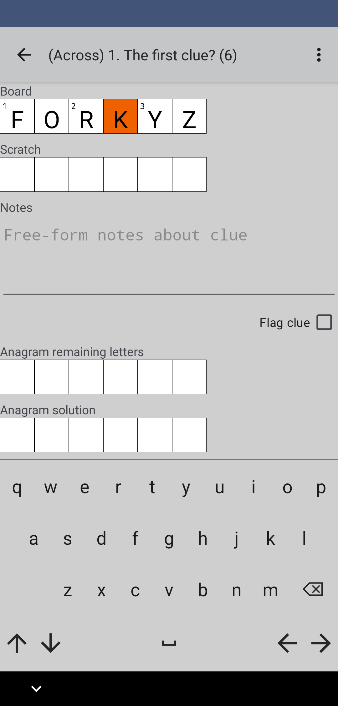
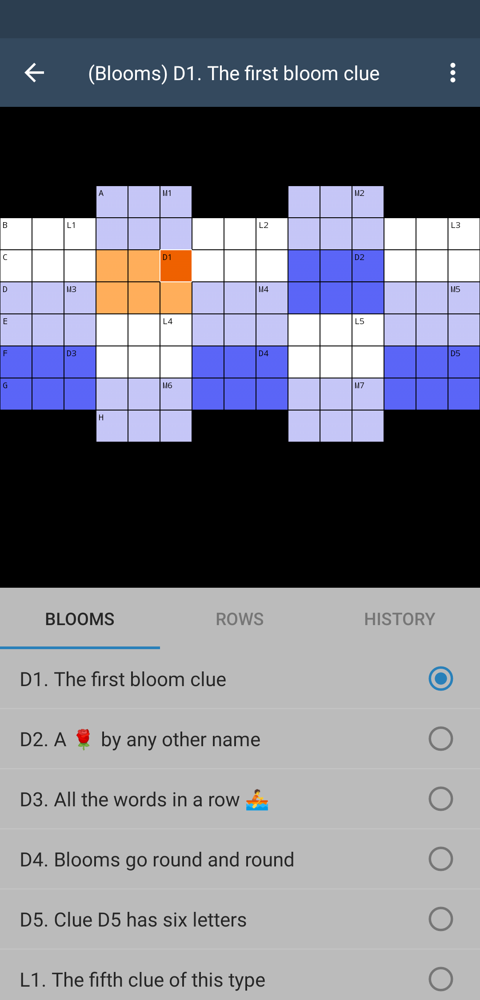
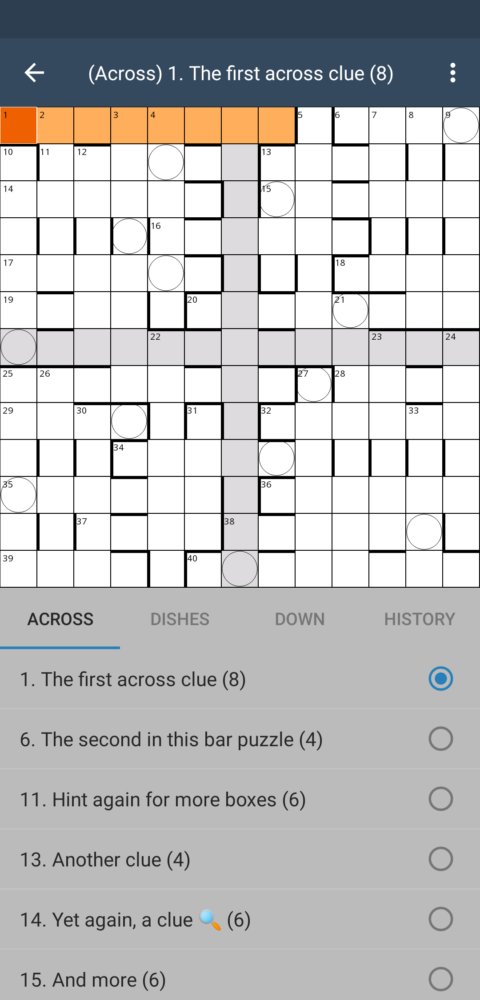
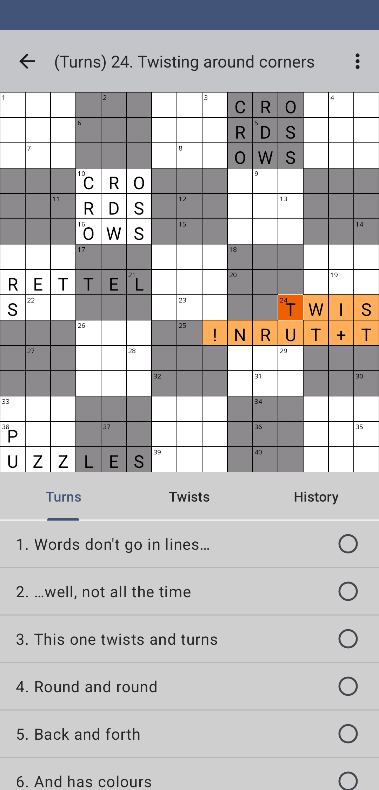
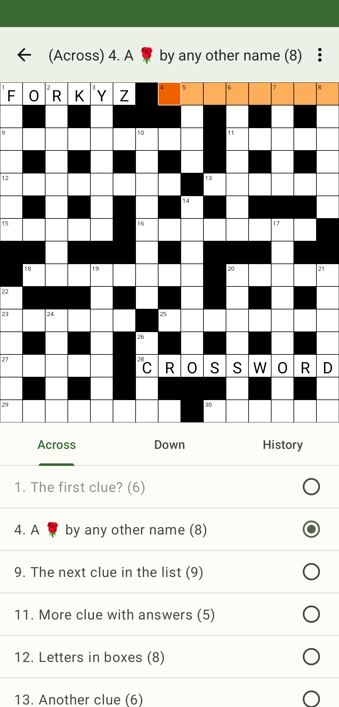
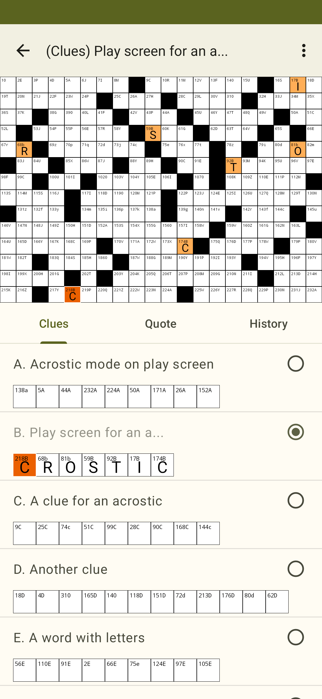

## Obtaining Puzzles

Puzzles can be obtained in two ways:

* import files, or
* use the built-in downloaders.

Files for import can be downloaded from a [number of websites][online-sources], or anywhere else you find them. I generally prefer this method over the downloaders since you get involved with the community.

Supported import file formats (can be zipped or unzipped):

* Across Lite (.puz),
* AmuseLabs JSON,
* BrainsOnly TXT,
* Guardian JSON and HTML,
* IPuz (crosswords only),
* JPZ,
* Keesing XML,
* King Features TXT,
* Przekroj Magazine JSON and HTML,
* RCI Jeux Mots-Fleches HJSON,
* Raetsel Zentrale Schwedenratsel JSON,
* Uclick XML.

Current downloaders are De Standaard, De Telegraaf, Guardian Daily Cryptic, Hamburger Abendblatt, Independent Daily Cryptic, Thomas Joseph Crossword, Le Parisien, Newsday, Sheffer Crossword, Universal Crosssword, USA Today, Jonesin' Crosswords, Premier Crossword, the Wall Street Journal (Sat/Sun), Keglar's Cryptics, Cryptic Cru Archives, Private Eye, and Przekroj Magazine.

## Compilation

Gradle should compile fine as long as you have Java 11 or above.

    $ ./gradlew assembleRelease

You will then need to handle signing/installing the apk. Hopefully this is standard.

## Project Structure

  * ./app The Android App.
  * ./puzlib A platform independent Java library for dealing with puzzle formats.
  * ./gfx Misc art assets.

## Thanks

Jonathan Blandford of [GNOME Crosswords][gnome-crosswords] for discussion on acrostics and the IPuz file on which the acrostic screenshot is based.

## License

Copyright (C) 2010-2016 Robert Cooper (and 2018- Forkyz Contributors)

Licensed under the GNU General Public License, Version 3

ipuz is a trademark of Puzzazz, used with permission

[gnome-crosswords]: https://gitlab.gnome.org/jrb/crosswords
[online-sources]: https://yourealwaysbe.github.io/forkyz/
